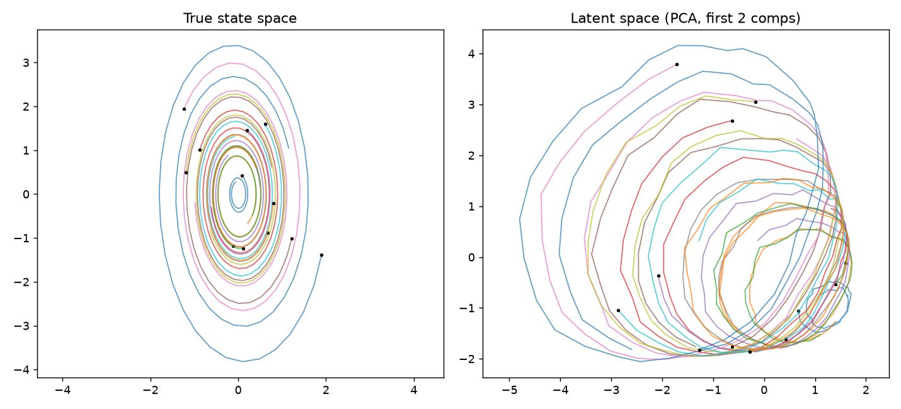
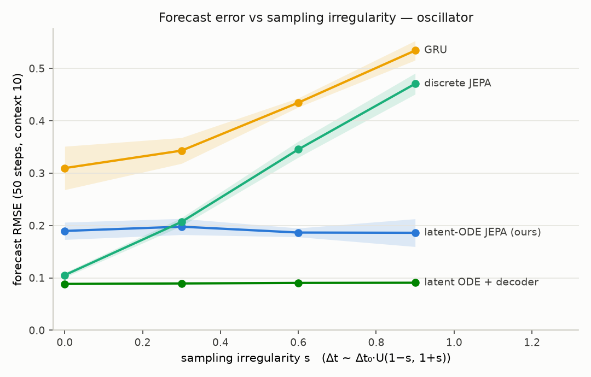
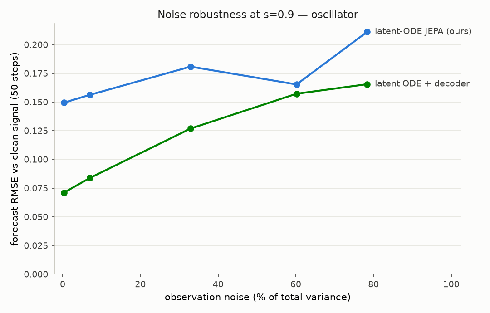
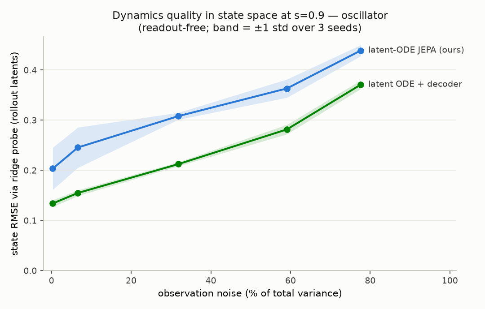
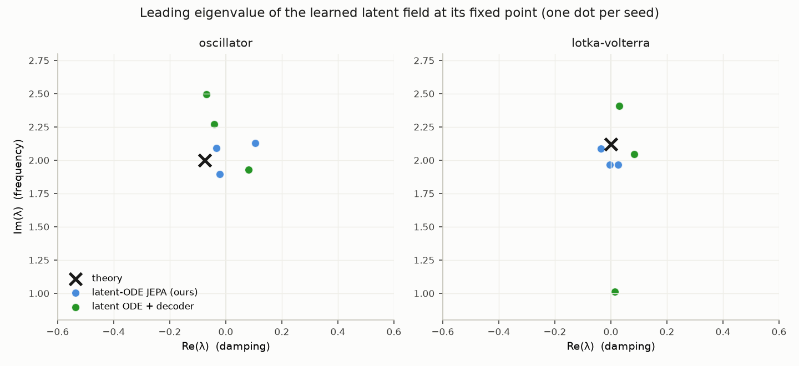
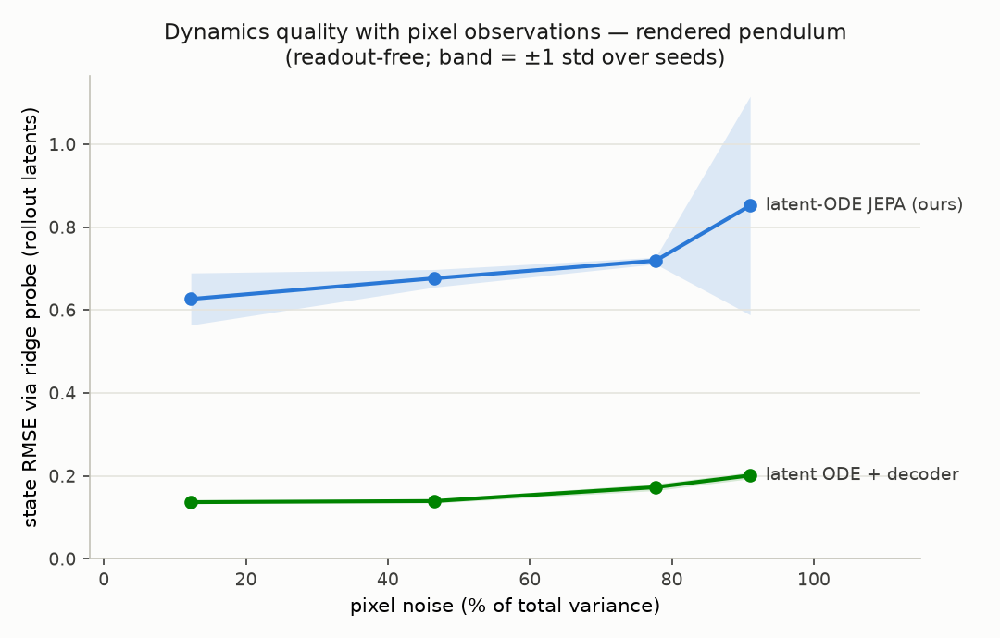

# latent-ode-dynamics

Mini proyecto de research: **predicción puramente latente (estilo JEPA) con dinámica de
tiempo continuo (Neural ODE), sin decoder**, para series temporales.

## Formulación

Sea $`\{x_t\}_{t=0}^T`$ una secuencia de observaciones, $`x_t \in \mathbb{R}^n`$, y
$`f_\theta : \mathbb{R}^n \to \mathbb{R}^d`$ un encoder por frame con $`d \ll n`$,
$`z_t = f_\theta(x_t)`$. Un campo vectorial aprendido
$`g_\phi : \mathbb{R}^d \to \mathbb{R}^d`$ define la dinámica latente

```math
\frac{dz(s)}{ds} = g_\phi(z(s)), \qquad \tilde z_{t+1} = z_t + \int_{t}^{t+1} g_\phi(z(s))\, ds
```

integrada numéricamente (Euler o RK4) sobre el $`\Delta t`$ real entre observaciones —
esto es lo que hace al modelo nativo para sampling irregular.

**Objetivo**:

```math
\mathcal{L} = \underbrace{D(\tilde z_{t+1}, \mathrm{sg}(z_{t+1}))}_{\text{one-step}}
+ \lambda_r \underbrace{D(\hat z_{t+k}, \mathrm{sg}(z_{t+k}))}_{\text{rollout libre, } k \le H}
+ \lambda_v \mathcal{L}_{\text{var}} + \lambda_c \mathcal{L}_{\text{cov}}
```

donde el rollout integra $`g_\phi`$ por $`H`$ intervalos sin re-encodear (fuerza a que
$`g_\phi`$ sea un campo vectorial genuino y no un residual de un paso), y los términos
de varianza y covarianza (estilo VICReg, a nivel batch) previenen el colapso — el rol
que en un Latent ODE clásico cumple el decoder. Targets con stop-gradient; target
encoder EMA opcional.

## Pregunta de investigación

> ¿Puede un modelo que aprende la derivada en el espacio latente, entrenado puramente
> con predicción latente (sin decoder), igualar a los Latent ODEs clásicos
> (Rubanova et al. 2019) en series muestreadas irregularmente, a menor costo?

- **H1**: la ventaja sobre predictores discretos (GRU / JEPA discreta) crece con la
  irregularidad del sampling.
- **H2**: sin decoder, el latente es más robusto a ruido de observación que un
  Latent ODE con reconstrucción.
- **H3**: el campo $`g_\phi`$ recupera la topología del sistema real (espiral, ciclo
  límite) viendo solo observaciones liftadas.

Trabajo más cercano: [JEPA + Neural ODE para state-space models](https://arxiv.org/abs/2508.10489)
(control con acciones, péndulo, evaluación cualitativa) y
[Phys-JEPA](https://arxiv.org/abs/2606.16076). Ninguno caracteriza forecasting sin
acciones bajo sampling irregular.

## Protocolo de evaluación (encoder y campo siempre congelados)

| Criterio | Métrica |
|---|---|
| No colapso | rank efectivo de $`z`$ (exp-entropía de valores singulares) |
| Latente informativo | probe ridge $`z \to`$ estado verdadero, $`R^2`$ |
| Forecasting | encodear contexto, rollout de $`g_\phi`$, decodear con probe MLP post-hoc, RMSE vs piso de reconstrucción y vs persistencia |
| Dinámica real | retrato de fases del latente (PCA) vs estado verdadero |

## Estado

- **Fase 0 (hecha)** — sanity en sintéticos con sampling regular, obs
  $`\mathbb{R}^{50}`$ (lift MLP random fijo + ruido), $`d=8`$:

  | | eff. rank | probe $`R^2`$ | forecast RMSE (50 pasos) | piso recon | persistencia |
  |---|---|---|---|---|---|
  | oscilador amortiguado | 3.8 / 8 | 0.99 | **0.17** | 0.15 | 1.46 |
  | Lotka-Volterra | 3.8 / 8 | 0.99 | **0.25** | 0.22 | 1.36 |

  Retratos de fase: espiral y ciclos cerrados recuperados — H3 pasa
  cualitativamente en ambos sistemas.

  

- **Fase 1 (hecha)** — sweep de irregularidad $`s`$ ($`\Delta t \sim \Delta t_0 \cdot U(1-s, 1+s)`$),
  oscilador, forecast RMSE (contexto 10, 50 pasos):

  | $`s`$ | ours | JEPA discreta | GRU | Latent ODE + decoder |
  |---|---|---|---|---|
  | 0.0 | 0.169 | **0.110** | 0.365 | **0.088** |
  | 0.3 | 0.208 | 0.200 | 0.369 | 0.089 |
  | 0.6 | **0.180** | 0.332 | 0.428 | 0.090 |
  | 0.9 | **0.160** | 0.453 | 0.509 | 0.091 |

  

  **H1 confirmada contra los modelos discretos**: los dos modelos continuos son
  planos en $`s`$, mientras la JEPA discreta degrada 4× (0.11 → 0.45, cruce en
  $`s \approx 0.35`$) y la GRU también empeora. La integración del campo — no la
  loss latente — es lo que absorbe la irregularidad. **Matiz honesto**: el Latent
  ODE con decoder sigue ganando en RMSE absoluto; pero el piso de reconstrucción
  del probe (~0.15) indica que casi todo el error nuestro es del *readout*
  post-hoc, no de la dinámica aprendida. La comparación decisiva es H2 (ruido).

- **Fase 2 (hecha)** — H2: sweep de ruido de observación con $`s=0.9`$ fijo,
  RMSE medido contra la señal **limpia** (los modelos solo ven la ruidosa):

  | ruido (% varianza) | 0% | 7% | 33% | 60% | 78% |
  |---|---|---|---|---|---|
  | ours | 0.149 | 0.156 | 0.181 | 0.165 | 0.211 |
  | Latent ODE + decoder | **0.071** | **0.084** | **0.127** | **0.157** | **0.166** |

  

  **H2 parcialmente soportada, sin cruce**: el mecanismo aparece — el Latent ODE
  con decoder degrada 2.3× más rápido (+133% vs +41% de RMSE) y en 60% de ruido
  quedan empatados — pero nuestro handicap constante de readout (probe post-hoc,
  piso ~0.15) impide que el orden se invierta en este rango. La comparación en
  espacio de observaciones conflata calidad de la *dinámica* con calidad del
  *readout*; el siguiente experimento debería comparar en espacio de estado
  (probe ridge $`z \to`$ estado verdadero bajo ruido), que es independiente del
  readout. Caveat: una sola seed (la curva nuestra es no-monótona por varianza
  de entrenamiento); un writeup serio necesita 3+ seeds con barras de error.

- **Fase 3 (hecha)** — H2 en espacio de estado, 3 seeds. Ridge readout-free
  sobre los latentes *rollouteados desde el contexto* → estado verdadero
  (state RMSE, media ± std):

  | ruido (% varianza) | 0% | 7% | 32% | 59% | 78% |
  |---|---|---|---|---|---|
  | ours | 0.204 ± .051 | 0.246 ± .049 | 0.308 ± .008 | 0.363 ± .022 | 0.439 ± .014 |
  | Latent ODE + decoder | **0.134 ± .008** | **0.155 ± .007** | **0.212 ± .005** | **0.282 ± .012** | **0.371 ± .010** |

  

  **H2 refutada.** Sin readout de por medio, el modelo con decoder aprende
  dinámica más precisa en todos los niveles de ruido (bandas de 3 seeds sin
  solapamiento), y ambos degradan con la misma pendiente absoluta (~+0.24 de
  0% a 78%). La "robustez relativa" que sugería la Fase 2 en espacio de
  observaciones era un artefacto: nuestro RMSE estaba dominado por el error
  constante del probe, lo que aplanaba la curva. Además el decoder-free es
  menos estable entre seeds. Conclusión: en este régimen (obs de dim 50, señal
  densa), la reconstrucción no contamina el latente — lo ancla. El argumento
  decoder-free queda condicionado a regímenes donde reconstruir es
  genuinamente caro o distractor (pixels), que es el territorio de V-JEPA.

- **Fase 5 / E1 (hecha)** — ¿el campo aprendido es un objeto dinámico genuino?
  Los autovalores de la linearización en un punto fijo son invariantes bajo
  conjugación suave, así que el Jacobiano de $`g_\phi`$ en su punto fijo debe
  reproducir el espectro del sistema verdadero. Newton sobre $`g_\phi(z)=0`$ +
  autograd, 3 seeds:

  | sistema | teoría | ours | lode |
  |---|---|---|---|
  | oscilador | $`-0.075 \pm 2.00i`$ | $`+0.02 \pm 2.04i`$ | $`-0.01 \pm 2.23i`$ |
  | Lotka-Volterra | $`0 \pm 2.12i`$ | $`-0.005 \pm 2.01i`$ | $`+0.04 \pm 1.82i`$ |

  

  Dos hallazgos: (1) **la frecuencia se recupera desde el latente con 2–5% de
  error** (ours), y la parte real sale ≈0 para el sistema conservativo — la
  versión cuantitativa de H3. El amortiguamiento ($`-0.075`$, 27× más chico que
  $`\omega`$) es demasiado fino: el signo varía entre seeds. (2) **El campo del
  modelo decoder-free está globalmente mejor comportado**: su punto fijo cae
  sobre la variedad de datos (0.3–1.4 escalas latentes, Newton converge a
  $`10^{-8}`$ siempre), mientras que el del baseline con decoder queda a 1.4–7
  escalas y Newton directamente falla en 2/6 corridas — su campo solo está
  entrenado a lo largo de trayectorias rollouteadas desde el contexto y es
  basura fuera de ellas. Primera victoria estructural del enfoque JEPA: pierde
  en precisión sobre la trayectoria (Fases 2–4) pero aprende mejor geometría
  global del campo.

- **Fase 5 / E2-E3 (hechas)** — E2, interpolación en tiempos no vistos: el test
  vive en una grilla fina ($`\Delta t = 0.05`$), el modelo observa 1 de cada 2
  muestras (su régimen de training) y predice el estado en los *midpoints*
  held-out integrando medio intervalo (state RMSE, 3 seeds):

  | integrar $`g_\phi`$ (solo pasado) | hold última obs | midpoint latente (usa futuro) |
  |---|---|---|
  | **0.122** | 0.165 | 0.115 |

  Consultado en un instante que no existe en ningún dato de entrenamiento, el
  campo (que solo mira el pasado) le gana 26% al no-dinámico y queda a 6% del
  interpolador que hace trampa usando la observación futura. Un predictor
  discreto ni siquiera puede formular esta consulta. ✅

  E3, ablación de integrador (Euler vs RK4 × substeps, forecast en
  $`s=0.9`$): euler-1 es el peor (0.222) e inestable (una seed explota a 0.29),
  euler-2 y rk4 quedan en 0.18–0.20 sin orden claro entre ellos. Evidencia
  parcial: la integración más gruesa duele, pero más allá de 2 substeps la
  varianza entre seeds domina — y como el modelo entrena *a través* de su
  integrador, se co-adapta al solver y la ablación queda confundida. La
  pregunta "¿campo genuino o bloque residual?" la responde mejor E2. ⚠️

- **Fase 6 (hecha)** — detector por consistencia dinámica. Entrenado solo con
  series normales (jitter 0.5), tres anomalías inyectadas a mitad de serie:
  cambio de régimen ($`\omega: 2 \to 2.5`$), impulso en velocidad, falla de
  sensor (10/50 dims congeladas). Score = residual de predicción z-scoreado
  por paso contra calibración normal; AUROC serie-a-serie, 3 seeds:

  | score | param | impulse | sensor | delay mediano (param) |
  |---|---|---|---|---|
  | ours, one-step latente | 0.88 | 1.00 | 0.78 ⚠️ | 2 pasos |
  | ours, rollout latente | 0.93 | 1.00 | 0.95 | — |
  | ours + probe obs (híbrido) | 0.88 | 1.00 | **0.98** | 2 pasos |
  | GRU, one-step obs | 0.88 | 1.00 | 0.99 | 5 pasos |
  | Latent ODE + decoder, rollout obs | **1.00** | 1.00 | **1.00** | 4 pasos |

  Hallazgos: (1) la detección por dinámica **funciona** — el impulso se detecta
  perfecto e instantáneo en todos los modelos. (2) El **punto ciego JEPA es
  real y medible**: el score latente puro no ve la falla de sensor (0.78 ≈
  azar+, porque el encoder aprendió a ignorar dims que no afectan la dinámica);
  agregar el stream de observaciones vía probe decoder lo cierra (0.98) sin
  costo en los otros tipos. (3) El mejor detector es el mejor modelo dinámico:
  el Latent ODE con decoder (Fases 2–4) domina con score de rollout, que
  acumula evidencia contra el forecast — la mitad de su ventaja en `param` es
  el modo de scoring (ours sube 0.88→0.93 al usarlo), la otra mitad es
  precisión de dinámica. (4) Trade-off señal-latencia: one-step detecta antes
  (2 vs 4 pasos) pero con menos poder; rollout al revés.

- **Fase 7 (hecha)** — el modelo unificado (`latentode/unified.py`): encoder
  por frame + campo + decoder entrenados juntos, loss = predicción latente
  (one-step + rollout) + **predicción decodificada contra observaciones
  futuras** (el gradiente del decoder entrena a $`g_\phi`$ vía el integrador) +
  ancla de reconstrucción. Validado contra sus dos "padres" en los tres
  frentes ya medidos (3 seeds):

  | frente | unified | JEPA solo | lode |
  |---|---|---|---|
  | state RMSE (ruido 0→78%) | 0.17→0.43 | 0.20→0.44 | **0.13→0.37** |
  | AUROC anomalías (param/imp/sensor) | **1.00 / 1.00 / 0.99** | 0.88 / 1.00 / 0.78 | 1.00 / 1.00 / 1.00 |
  | autovalores oscilador | $`-0.049 \pm 1.89i`$ ✓ | $`+0.02 \pm 2.04i`$ | Newton falla |

  Resultado: mejora al JEPA puro en precisión en todos los niveles de ruido
  (~15%), **empata con el lode en la tarea que importa** (detección: ≥0.99 en
  los tres tipos, sin punto ciego — su propio decoder provee el stream
  observacional), y es el primero que recupera el **signo del amortiguamiento
  consistentemente** (parte real negativa en 3/3 seeds; el JEPA lo tenía
  aleatorio). Pendiente honesto: en precisión pura queda ~20% detrás del lode,
  y la geometría del campo en Lotka-Volterra es inestable (2/3 seeds con punto
  fijo off-manifold) — la herencia de E1 es parcial.

- **Fase 8 (hecha)** — clasificación multi-clase por consistencia dinámica +
  open-set. Cuatro regímenes como clases (oscilador estándar / rápido
  $`\omega=2.8`$ / muy amortiguado $`\gamma=0.7`$ / Lotka-Volterra), un
  `UnifiedLatentODE` por clase entrenado solo con series de su régimen;
  asignación por menor residual de rollout z-scoreado. Baseline: GRU
  supervisada con labels. Umbrales de rechazo calibrados a 95% de aceptación
  in-distribution en ambos. 3 seeds:

  | | accuracy (4 clases) | rechazo de régimen NO visto (Van der Pol) |
  |---|---|---|
  | clasificador por campos (gen.) | **100.0%** (768/768) | **100%** |
  | GRU supervisada (disc.) | 99.6% | 29% |

  Matriz de confusión perfecta en las 3 seeds. El resultado central es la
  columna derecha: ante un régimen dinámico nunca visto, el clasificador
  generativo dice "esto no encaja en ninguna dinámica conocida" el 100% de
  las veces, mientras la GRU — estructuralmente obligada a elegir — clasifica
  con confianza el 71% de las series de Van der Pol en alguna clase falsa.
  Esa es la capacidad que justifica el enfoque. Limitación a declarar: el
  costo escala linealmente con el número de clases (un campo por régimen).

## Aplicación objetivo: clasificación por consistencia dinámica

La dirección aplicada del proyecto: usar el campo aprendido para detectar
anomalías (una serie que se desvía de la dinámica aprendida) y clasificar por
régimen dinámico (un campo por clase, asignar por menor residual). Trabajo
cercano: [Latent SDEs para AD irregular](https://arxiv.org/abs/2606.18898)
(estocástico, score por verosimilitud, costo alto); nicho nuestro: campo
determinístico barato, score por residual (localiza el inicio de la anomalía),
sampling irregular (H1) y multi-clase. La refutación de H2 es una decisión de
diseño acá: entrenar **con** decoder ancla el encoder (una observación anómala
no puede esconderse en la variedad normal), y el hallazgo (2) de E1 sugiere
scorear con un campo entrenado estilo JEPA, mejor comportado fuera de la
variedad — justo donde vive lo anómalo.

## Conclusiones

1. **H1 ✅** — la integración continua del campo latente absorbe el sampling
   irregular; la ablación exacta (JEPA discreta, idéntica salvo la integración)
   degrada 4×. Este es el resultado positivo del proyecto.
2. **H2 ❌** — quitar el decoder no mejora la robustez a ruido en ninguno de
   los dos regímenes probados: ni con observaciones densas de baja dimensión
   (Fase 3) ni con pixels (Fase 4), donde el margen es aún mayor y se suma
   fragilidad de entrenamiento. La reconstrucción produce dinámica
   uniformemente mejor y entrena robusto. Resultado negativo, medido limpio.
3. **H3 ✅** (cualitativa) — el campo aprendido recupera la topología del
   sistema (espiral, ciclos) solo desde observaciones liftadas.

La combinación ganadora en todos los regímenes probados es: **dinámica continua
(de H1) + decoder (de H2-H4)** — esencialmente el Latent ODE de Rubanova. La
Fase 4 descarta también el nicho "pixels chicos": a 32×32 el decoder sigue
ganando cómodo y entrena más robusto. El nicho que queda sin probar para el
decoder-free continuo es la escala V-JEPA real (video de alta resolución, donde
reconstruir es computacionalmente prohibitivo) y las tareas que nunca
decodifican (control/planning en el latente).

- **Fase 4 (hecha)** — H2 con pixels: péndulo renderizado 32×32 (pares de
  frames con canal-diferencia, mismo input para ambos modelos), sweep de ruido
  por pixel, misma métrica readout-free de la Fase 3, 2 seeds:

  | ruido (% varianza) | 12% | 47% | 78% | 91% |
  |---|---|---|---|---|
  | ours (tuneado) | 0.63 ± .06 | 0.68 ± .02 | 0.72 ± .01 | 0.85 ± .37 |
  | Latent ODE + decoder | **0.137 ± .001** | **0.140 ± .005** | **0.173 ± .01** | **0.201 ± .01** |

  

  **H2 refutada también en pixels — y con más margen.** El decoder degrada
  suavemente incluso cuando el 91% de la varianza del pixel es ruido (0.14 →
  0.20), mientras el decoder-free queda 4× peor en todo el rango y una seed
  directamente divergió a ruido máximo. El hallazgo extra es de *entrenabilidad*:
  el baseline con decoder funcionó a la primera; el JEPA continuo necesitó
  canal-diferencia (sin él no aprende la velocidad: la señal inter-frame de
  ≤1.5 px se pierde), EMA target en vez de VICReg fuerte (que fuerza un mal
  equilibrio: estirar una variedad 2D a $`d`$ dims decorrelacionadas produce
  features no integrables), projector con LayerNorm y horizonte de rollout
  largo — y aún así quedó atrás e inestable entre seeds. La fragilidad de
  optimización es un costo real y poco reportado del enfoque decoder-free a
  esta escala.

## Correr

```bash
python3 experiments/phase0.py --system oscillator
python3 experiments/phase0.py --system lotka_volterra
python3 experiments/phase0.py --system oscillator --jitter 0.8  # sampling irregular
python3 experiments/phase1.py --system oscillator               # sweep H1 (baselines)
```

Requiere `torch`, `numpy`, `matplotlib`. Resultados (JSON + PNG) en `results/`.
