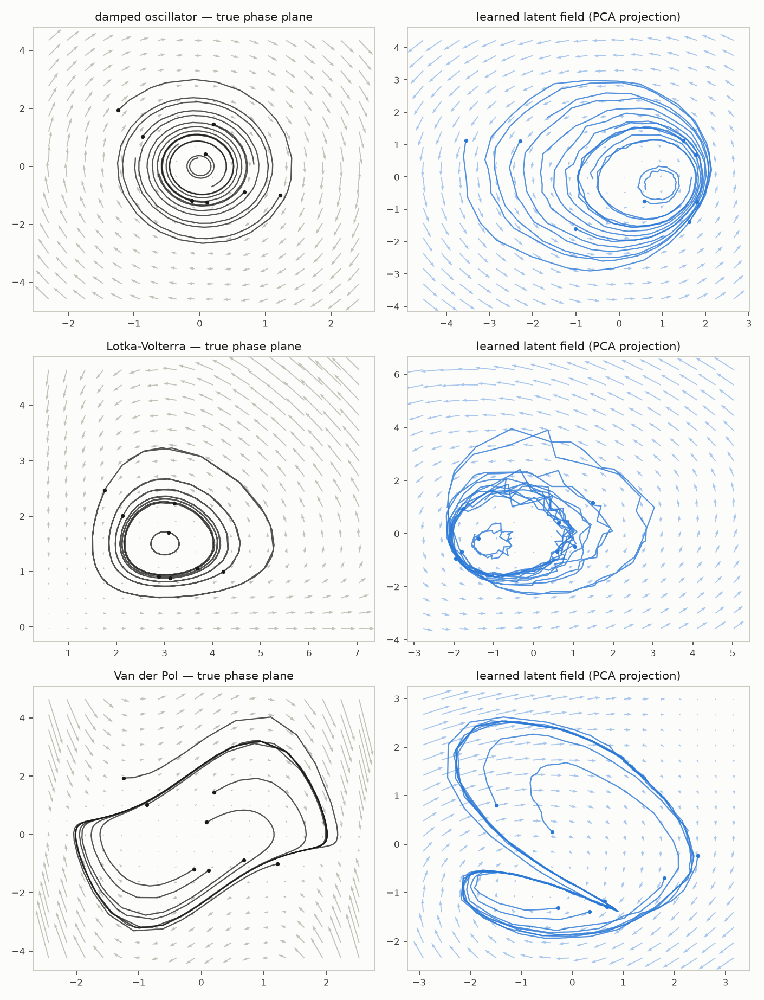
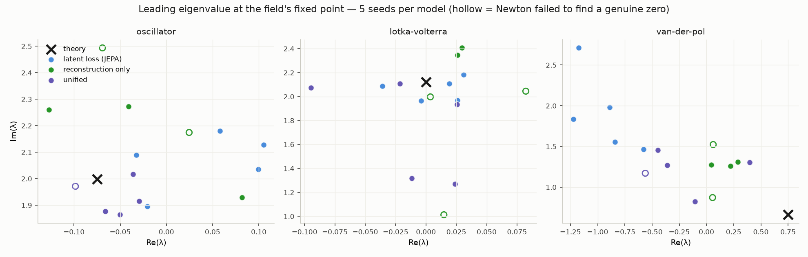

# latent-ode-dynamics

**Learning the derivative of a system in latent space, and using it to
classify time series by their dynamics.**

An encoder $`f_\theta`$ maps observations
$`x_t \in \mathbb{R}^n`$ to latents $`z_t \in \mathbb{R}^d`$ ($`d \ll n`$),
and a learned vector field $`g_\phi`$ defines continuous-time latent dynamics

```math
\frac{dz(s)}{ds} = g_\phi(z(s)),
```

integrated numerically (Euler/RK4) over the *actual* time gaps between
observations. The project runs a component-by-component design study of this
architecture on controlled synthetic systems, then applies it to anomaly
detection and open-set classification of irregularly-sampled time series —
including two real datasets. Every design decision is backed by its own
ablation; negative results are reported alongside positive ones.

## Findings at a glance

**Capability** — the learned field is a genuine dynamical object: it absorbs
irregular sampling where discrete models degrade 4.5× (E1), reproduces the
true system's physical constants from its Jacobian eigenvalues (E3), and can
be queried at time points that exist in no training data (E3).

**Design anatomy** — the decoder is necessary (decoder-free training loses on
accuracy, noise robustness and trainability, in two observation regimes; E2),
but the latent prediction loss buys globally well-behaved field geometry that
decoder-only training lacks (E3). The final architecture combines both.

**Application** — dynamics-consistency scores detect anomalies (AUROC
0.88–1.00) but latent-only scoring has a structural blind spot, fixed by a
hybrid score (E4); one-field-per-regime classification achieves perfect
closed-set *and* open-set performance on synthetic regimes (100% rejection of
never-seen dynamics vs 29% for softmax; E5); real data reveals the method's
scope condition — it classifies *dynamics laws*, not *control programs* (E6).

---

## The architecture

```
x_t ──► encoder f_θ ──► z_t ──► dz/ds = g_φ(z)  (Euler/RK4 over real Δt)
                         │
                         └──► decoder D ──► x̂
```

Trained jointly with four loss terms (`latentode/unified.py`):

```math
\mathcal{L} =
\underbrace{\|\tilde z_{t+1} - \mathrm{sg}(z_{t+1})\|^2 + \|\hat z_{t+k} - \mathrm{sg}(z_{t+k})\|^2}_{\text{latent prediction (one-step + free rollout)}}
+ \underbrace{\|D(\hat z_{t+k}) - x_{t+k}\|^2}_{\text{decoded prediction of the future}}
+ \underbrace{\|D(z_t) - x_t\|^2}_{\text{reconstruction anchor}}
```

where $`\hat z`$ denotes latents produced by *integrating the field*: the
decoded-prediction term is the gradient path through which the decoder teaches
$`g_\phi`$, and the free rollout (integrating $`H`$ intervals with no
re-encoding) is what forces $`g_\phi`$ to be a genuine vector field rather
than a one-step residual block. Mild VICReg variance/covariance terms
regularize the latent. Every term earned its place through the experiments
below.

---

## Experiments in detail

### Common setup (synthetic experiments, E1–E5)

Ground-truth systems are 2-dimensional — a damped oscillator
($`\ddot x = -\omega^2 x - \gamma \dot x`$, $`\omega=2`$, $`\gamma=0.15`$) and
Lotka-Volterra — integrated finely with RK4. The model never sees the state:
observations are a **fixed random MLP lift** of the state to
$`\mathbb{R}^{50}`$ plus Gaussian noise, so the encoder must discover the 2D
manifold on its own. Irregular sampling is controlled by a single parameter
$`s`$: gaps are drawn as $`\Delta t \sim \Delta t_0 \cdot U(1-s,\, 1+s)`$, so
$`s=0`$ is a regular grid and $`s=0.9`$ spans a 19× range of gap sizes with
the same mean. Experiments report 3 seeds with ±1 std unless noted.

**Evaluation is readout-free wherever possible.** Since the true state is
known for synthetic systems, we freeze the trained encoder and field, roll
the field forward from an encoded context, and fit a closed-form ridge
regression from the rolled-out latents to the true state. The resulting
**state RMSE** measures the quality of the learned *dynamics* with no
trainable decoder in the metric — a lesson learned the hard way in E2.

### E1 — Does continuous integration matter? (phase 1)

**Design.** The claim "integrating a vector field handles irregular sampling"
needs an exact control: a model identical in every respect except that
$`\tilde z_{t+1} = z_t + \mathrm{MLP}(z_t, \Delta t)`$ replaces the
integration — same encoder, same losses, Δt still provided as input. If the
continuous model wins only because of capacity or the latent loss, this
ablation wins too. We sweep $`s`$ and measure 50-step forecast RMSE (context
10) through a frozen post-hoc decoder probe, plus a GRU forecaster and a
classic decoder-based latent ODE for reference.


| $`s`$ | continuous (ours) | discrete JEPA | GRU | latent ODE + decoder |
|---|---|---|---|---|
| 0.0 | 0.190 ± .020 | **0.105 ± .006** | 0.310 ± .051 | **0.088 ± .001** |
| 0.9 | **0.186 ± .033** | 0.471 ± .025 | 0.534 ± .023 | 0.091 ± .001 |

**Reading.** Both continuous models are flat in $`s`$; both discrete models
degrade steeply (the exact ablation by 4.5×, crossing ours at
$`s \approx 0.35`$). Since the only difference between ours and the discrete
JEPA is the integration, the experiment isolates the cause: **it is the ODE
integration, not the latent loss, that absorbs irregular sampling.** Note the
discrete model is *better* on the regular grid — with fixed Δt an
unconstrained MLP step is easier to fit. The continuous bias pays exactly
when sampling is irregular, which is its use case.

### E2 — Is the decoder necessary? (phases 2–4)

**Design.** JEPA-style training predicts in latent space with no decoder,
using stop-gradient targets and VICReg anti-collapse instead. Is that enough —
or does the reconstruction loss of classic latent ODEs anchor the latent in a
way pure latent prediction cannot? We compare our decoder-free model against
a deterministic Rubanova-style latent ODE (GRU context encoder → same field
class → decoder, trained on reconstruction), sweeping observation noise from
0% to 78% of total variance at $`s=0.9`$, with error measured against the
**clean** signal (models only ever see noisy data).

**The metric trap (phase 2 → 3).** Measured in observation space, our model
looked *flat* under noise while the decoder baseline degraded 2.3× faster —
apparently confirming that reconstruction forces the latent to model noise.
This was an artifact: our observation-space error was dominated by the
constant error of the frozen readout probe, which flattened the curve. The
readout-free state-space metric reverses the verdict:


The decoder-based model learns uniformly more accurate dynamics at every
noise level (non-overlapping 3-seed bands), and both models degrade at the
same absolute rate. **Reconstruction does not pollute the latent — it anchors
it.**

**Pixels (phase 4).** The standard argument for decoder-free training is that
reconstructing pixels is wasteful. We rendered the oscillator as a 32×32
pendulum video (stacked frame pairs; a single frame contains no velocity) and
swept pixel noise up to 91% of variance — the most decoder-hostile setting we
could build:


The decoder baseline barely degrades (0.14 → 0.20) while the decoder-free
model sits 4× worse everywhere, diverging at max noise in one seed — *after*
requiring four fixes to train at all (an explicit frame-difference channel,
EMA targets instead of strong VICReg, a LayerNorm projector, long-horizon
rollout supervision). The decoder model trained robustly out of the box.
**Training fragility is a real, under-reported cost of decoder-free training
at this scale.**

### E3 — Is the learned field a genuine dynamical object? (phase 5)

**Phase portraits, true vs learned.** The qualitative evidence first: for
each system, the true phase plane (vector field + trajectories) next to the
learned latent field, projected onto the top-2 PCA plane of the latents —
the quiver is $`g_\phi`$ evaluated on a grid of that plane. The model has
never seen the state; latent coordinates are arbitrary, so the correct
expectation is a *diffeomorphic image* of the true portrait — same topology,
deformed geometry. That is what appears: the oscillator's spiral sink,
Lotka-Volterra's nested closed orbits, and Van der Pol's **limit cycle** —
trajectories from inside and outside converging to the same closed curve, a
topology no linear system can produce:



**Eigenvalue recovery — the idea.** The latent coordinates are arbitrary: the
encoder could have learned any rotated, stretched, warped version of the true
state space, so comparing the learned field to the true one coordinate by
coordinate is meaningless. What we need is a property of the dynamics that
**survives any smooth change of coordinates**. Linearization spectra at fixed
points are exactly that. Concretely:

- A *fixed point* is a state $`z^*`$ where the dynamics stops:
  $`g(z^*) = 0`$ (the oscillator at rest; predator and prey in equilibrium).
- Near a fixed point, the nonlinear system behaves like its *linearization*
  $`\dot{\delta z} = J\,\delta z`$, where $`J = \partial g / \partial z`$ is
  the Jacobian at $`z^*`$. Solutions of that linear system are combinations
  of modes $`e^{\lambda t}`$, one per eigenvalue $`\lambda = a \pm bi`$ of
  $`J`$ — and each part of $`\lambda`$ has physical meaning:
  **$`\mathrm{Im}(\lambda) = b`$ is the angular frequency** of rotation
  around the fixed point, and **$`\mathrm{Re}(\lambda) = a`$ is the
  contraction rate** (negative = damped spiral in, zero = closed orbits,
  positive = unstable).
- Now the key fact: if the latent dynamics is the true dynamics seen through
  a smooth invertible map $`h`$ (encoder ∘ lift), the chain rule gives
  $`J_{\text{latent}} = Dh \; J_{\text{true}} \; Dh^{-1}`$ on the embedded
  state manifold — a *similarity transform*, and **similar matrices have
  identical eigenvalues**. The map $`Dh`$ (which we don't know and never
  compute) cancels out. So the eigenvalues of the learned field's Jacobian
  are a coordinate-free fingerprint: if the dynamics law was truly learned,
  the true system's $`\lambda`$ must reappear in the latent, exactly.

For our systems the theoretical targets follow from their equations. The
damped oscillator ($`\dot x = v`$, $`\dot v = -\omega^2 x - \gamma v`$,
$`\omega = 2`$, $`\gamma = 0.15`$) has
$`\lambda = -\tfrac{\gamma}{2} \pm i\sqrt{\omega^2 - \gamma^2/4} = -0.075 \pm 1.999i`$
— a slow damped spiral rotating at essentially $`\omega`$. Lotka-Volterra at
its coexistence equilibrium has purely imaginary
$`\lambda = \pm i\sqrt{\alpha\gamma} = \pm 2.121i`$ — no damping at all,
which is why its orbits close.

**Procedure.** The latent field is $`d=8`$-dimensional, so: (1) find its
fixed point by damped Newton on $`g_\phi(z) = 0`$, starting from the mean of
the encoded data; (2) get $`J \in \mathbb{R}^{8\times 8}`$ by autograd;
(3) eigendecompose. Six of the eight eigenvalues describe the directions
*transverse* to the learned 2D manifold (they should be strongly contracting
— the manifold attracts); the complex-conjugate pair with the largest
imaginary part is the oscillatory plane tangent to the dynamics, and that is
what we compare against theory. Two sanity checks guard the procedure: the
Newton residual (did we actually find a zero of the field?) and the distance
from $`z^*`$ to the nearest encoded data point in units of the latent scale
(is the fixed point where the data lives, or a spurious zero far away?).


| system | theory | ours | decoder-only baseline |
|---|---|---|---|
| oscillator | $`-0.075 \pm 2.00i`$ | $`+0.02 \pm 2.04i`$ | $`-0.01 \pm 2.23i`$ |
| Lotka-Volterra | $`0 \pm 2.12i`$ | $`-0.005 \pm 2.01i`$ | $`+0.04 \pm 1.82i`$ |

**Reading.** The frequency ($`\mathrm{Im}\,\lambda`$) is recovered within
2–5%, and the conservative system's contraction rate comes out ≈0 as it must
— physical constants extracted from a latent space trained only on lifted,
noisy observations, with no access to the state, its dimensionality, or the
equations. The damping ($`-0.075`$, 27× smaller than the frequency) sits
below seed resolution for the decoder-free model; notably, the *unified*
model of phase 7 is the only variant that recovers its sign in 3/3 seeds
($`-0.049`$ mean). The sanity checks also expose a structural asymmetry: our
field's fixed point lies **on the data manifold** (0.3–1.4 latent scales
away, Newton residual $`\sim 10^{-8}`$ every run), while the decoder-only
baseline's field — trained only along rollout trajectories — places fixed
points 1.4–7 scales off-manifold and Newton fails outright in 2/6 runs. The
per-frame latent prediction loss, applied across the whole manifold, buys
**global field geometry** that trajectory-only training lacks — the property
that matters when anomalous data pushes latents off the normal manifold.

**Robustness, and the edge of the advantage (phase 12).** The dissociation
above is the one place the latent-prediction loss *beats* reconstruction, so
we stress-tested it: 3 systems × 3 models × 5 seeds, adding Van der Pol —
whose fixed point is **unstable** (theory $`+0.75 \pm 0.66i`$) and sits
inside the limit cycle, where trajectories never linger:



| | Newton finds a genuine zero | freq. error (osc / L-V) | fixed point on-manifold |
|---|---|---|---|
| latent loss (JEPA) | **100%** of 15 runs | **3% / 3%** | **0.5–0.6** scales |
| reconstruction only | 40–60% | 11% / 8% | 1.0–2.3 scales |
| unified | 80–100% | 4% / 18% | 0.8–2.6 scales |

Three results. (1) The advantage is robust where it was claimed: with 5
seeds, the latent-loss field's fixed-point structure is categorically more
reliable. (2) **Van der Pol marks the edge**: *no* model recovers the
unstable spectrum — the latent-loss model even gets the stability sign wrong
(its field thinks the repelling origin attracts). The reason is fundamental:
every loss supervises the field where data *lives*, and the repelling
interior of a limit cycle is precisely where data never stays. Supervision
cannot conjure structure in regions the data does not visit. (3) A
null result worth reporting: an off-manifold *flow* test (perturb latents by
up to 4 latent scales, integrate 5 time units, measure the distance back to
the manifold) shows **no difference** between models — all fields are
similarly bounded at short horizons. The advantage is *structural* (where
the zeros are, whether the linearization is meaningful), not dynamical
explosiveness.

Together these refine the finding into its final form: **where the loss
lives determines where the field is trustworthy — per-frame latent
prediction buys reliable structure exactly on and near the data manifold;
no loss buys structure where data never goes; and reconstruction-only
training leaves even data-adjacent structure unreliable.**

**Querying times that don't exist.** On a test grid of double resolution, the
model observes every 2nd sample and must predict the state at the held-out
midpoints by integrating half an interval — a time offset reachable only
through the vector field. It lands within 6% of an interpolator that cheats
by using the *future* observation, and 26% ahead of holding the last
observation. A discrete-time model cannot even express this query.

**Unified model (phase 7).** Combining both losses (the architecture above)
beats decoder-free accuracy at every noise level, matches the decoder model
on the application metrics of E4, and is the only variant that recovers the
damping *sign* consistently across seeds. It remains ~20% behind the pure
decoder model in raw state accuracy — an open tuning question.

### E4 — Anomaly detection by dynamics consistency (phase 6)

**Design.** Train on normal series only ($`s=0.5`$); inject three anomaly
types mid-series at a random onset: a regime change
($`\omega: 2 \to 2.5`$), a velocity impulse, and a sensor fault (10 of 50
observation dims frozen). Score each step by its prediction residual,
z-scored per horizon step against a normal calibration split; a series'
score is its max. Thresholds are set at 5% false-positive rate on
calibration. AUROC over 3 seeds:

| score | regime change | impulse | sensor fault |
|---|---|---|---|
| latent one-step (ours) | 0.88 | 1.00 | **0.78** ⚠️ |
| latent rollout (ours) | 0.93 | 1.00 | 0.95 |
| hybrid latent + decoded (ours) | 0.88 | 1.00 | **0.98** |
| GRU obs residual | 0.88 | 1.00 | 0.99 |
| latent ODE + decoder, rollout | **1.00** | 1.00 | **1.00** |

**Reading.** Three lessons. (1) The purely latent score is nearly blind to
the sensor fault: the encoder learned to *discard* dimensions that don't
affect the dynamics — its virtue as a representation is its flaw as a
detector. Adding a decoded observation-space stream restores detection
(0.78 → 0.98) at no cost elsewhere. (2) The best dynamics model is the best
detector, and a control experiment decomposes its advantage: scoring
*mode* accounts for half (rolling out from a clean context accumulates
evidence against a persistent regime change — ours improves 0.88 → 0.93 by
adopting it), dynamics accuracy for the rest. (3) One-step scores detect
faster (median 2 vs 4 steps) but with less power — a practical
latency/power dial.

### E5 — Open-set classification on synthetic regimes (phase 8)

**Design.** Four regimes as classes (standard / fast / heavily-damped
oscillator, Lotka-Volterra). One unified model per class, trained only on
its regime. A test series is assigned to the class whose field explains it
best (lowest z-scored residual); if **every** class rejects it (score above
that class's 95% calibration quantile), the series is flagged as an unknown
regime. The baseline is a supervised GRU classifier with max-softmax
rejection, calibrated to the same 95% in-distribution acceptance. The unseen
regime is a Van der Pol oscillator — never seen by any model.

| | closed-set accuracy | rejection of unseen regime |
|---|---|---|
| per-class fields (generative) | **100.0%** (768/768, 3 seeds) | **100%** |
| supervised GRU (discriminative) | 99.6% | 29% |

**Reading.** Closed-set, the generative classifier separates close regimes
perfectly (confusion matrix diagonal across all seeds) — while never having
seen a label. The headline is the right column: faced with dynamics that fit
no known class, the field-based classifier says so every single time, while
the discriminative model — structurally forced to pick a class — confidently
misclassifies 71% of them. This rejection capability is *architectural*: a
generative model of each regime has a notion of "none of the above" that a
softmax cannot express.

### E6 — Real data and the method's scope condition (phases 9–10)

**Design.** Two real datasets, both irregularly subsampled (40 random time
points per series) with a short Takens delay embedding (a single frame of a
real signal does not determine the state): **CharacterTrajectories** (UCI;
2858 pen trajectories, 20 letter classes) and **UCI HAR** (inertial signals,
6 activities; 'downstairs' held out as the unseen regime).

| dataset | generative acc | supervised GRU acc | open-set gen | open-set GRU |
|---|---|---|---|---|
| synthetic (E5) | 100% | 99.6% | 100% | 29% |
| CharacterTrajectories | 39% | 96% | 33% | 43% |
| UCI HAR | 43–57% | 91% | **34%** | 7% |

**Reading.** The synthetic-to-real gap is itself the finding, in three parts.
(1) **Scope condition**: characters share the same pen physics — letters
differ in the *control program*, not the *dynamics law* — and the method
collapses; human activities are genuinely different body dynamics, and the
5× open-set advantage survives. The method classifies dynamics laws. (2)
**Score design is non-trivial on real data**: rollout scoring (E4's winner)
fails here because entire series belong to different classes — one-step
scoring nearly doubles accuracy; and signed z-scores let high-residual
classes attract easy series (a sitting series scores *suspiciously well*
under the walking field), motivating a typicality score $`|z|`$ with its own
trade-offs. (3) **The obvious architectural fix was tested — and refuted**
(phase 11): the leading hypothesis for the remaining gap was that per-class
encoders receive off-distribution inputs from other classes, making their
residuals noise rather than evidence. A shared encoder/decoder with
per-class fields (one common latent space, residuals comparable by
construction) did *not* close the gap — it slightly worsened both datasets
(HAR 40% vs 43–57%; characters 32% vs 39%). Two readings survive: sharing
removes the per-class feature specialization that separate encoders
provided, and — more fundamentally — the residual probes *local* dynamics,
and real-world classes overlap heavily in their local dynamics (walking and
climbing stairs share the gait oscillation; sitting and standing share
near-zero motion). The scope condition sharpens: what must differ is the
dynamics law *at the temporal scale the residual probes*. Closing this gap
is the project's open problem.

---

## Repository map

| path | contents |
|---|---|
| `latentode/` | library: data generators, models (JEPA, baselines, unified), losses, training, eval, pixel & real-data pipelines |
| `experiments/` | one runnable script per phase (`phase0.py` … `phase10.py`) + figure scripts |
| `results/` | committed JSON results backing every number above (figures regenerable) |
| `assets/` | key figures |
| `docs/LAB_NOTEBOOK.md` | phase-by-phase chronological log with all tables and caveats (Spanish) |
| `docs/NARRATIVA.md` | the findings organized into the project's narrative (Spanish) |

## Reproduce

Python ≥ 3.11.

```bash
pip install -r requirements.txt
bash scripts/download_data.sh   # only needed for phase 10 (UCI HAR)

python3 experiments/phase0.py --system oscillator   # sanity, ~2 min CPU
python3 experiments/phase1.py --seeds 0 1 2         # E1 sweep, ~35 min
python3 experiments/phase3.py                       # E2 state-space study, ~35 min
python3 experiments/phase4.py                       # E2 pixels (uses Apple MPS), ~1 h
python3 experiments/phase5_field.py                 # E3 eigenvalues, ~25 min
python3 experiments/phase5_e23.py                   # E3 interpolation + solver, ~15 min
python3 experiments/phase6.py                       # E4 anomaly detection, ~15 min
python3 experiments/phase7_unified.py               # unified-model validation, ~30 min
python3 experiments/phase8.py                       # E5 open-set classifier, ~15 min
python3 experiments/phase9.py                       # E6 CharacterTrajectories, ~5 min/seed
python3 experiments/phase10.py                      # E6 UCI HAR, ~5 min/seed
```

All experiments are seeded; figure scripts (`experiments/plot_phase*.py`)
regenerate every PNG from the committed `results/*.json`, which contain the
exact numbers reported above.

## Data

- **CharacterTrajectories** (UCI ML Repository, CC BY 4.0) — included as
  `data/mixoutALL_shifted.mat`.
- **UCI HAR** (Anguita et al. 2013, UCI ML Repository) — downloaded by
  `scripts/download_data.sh`.
- All synthetic systems (damped oscillator, Lotka-Volterra, Van der Pol,
  rendered pendulum) are generated by `latentode/data.py` / `latentode/pixels.py`.

## Related work

Closest neighbors: latent ODEs ([Rubanova et al. 2019](https://arxiv.org/abs/1907.03907)),
JEPA + neural ODE state-space models ([2508.10489](https://arxiv.org/abs/2508.10489)),
Phys-JEPA ([2606.16076](https://arxiv.org/abs/2606.16076)), latent SDEs for
anomaly detection ([2606.18898](https://arxiv.org/abs/2606.18898)), neural
CDEs ([Kidger et al. 2020](https://arxiv.org/abs/2005.08926)). This project's
distinguishing angle: the exact continuous-vs-discrete ablation, the
readout-free evaluation protocol, the JEPA blind-spot finding, and open-set
classification by dynamics consistency.

## Limitations & next steps

Synthetic systems are low-dimensional; real-data classification still trails
a supervised GRU in closed-set accuracy (the open-set advantage is the
method's edge); the unified model trails the pure decoder model ~20% in raw
state accuracy; the shared-encoder fix for the real-data gap was tested and
refuted (phase 11), leaving multi-scale dynamics scoring as the open
problem. Also open: damping recovery below seed resolution, a Neural CDE
baseline, PhysioNet, and a stochastic (SDE) field.

## License & citation

MIT — see [LICENSE](LICENSE). If you use this work, please cite via
[CITATION.cff](CITATION.cff).
